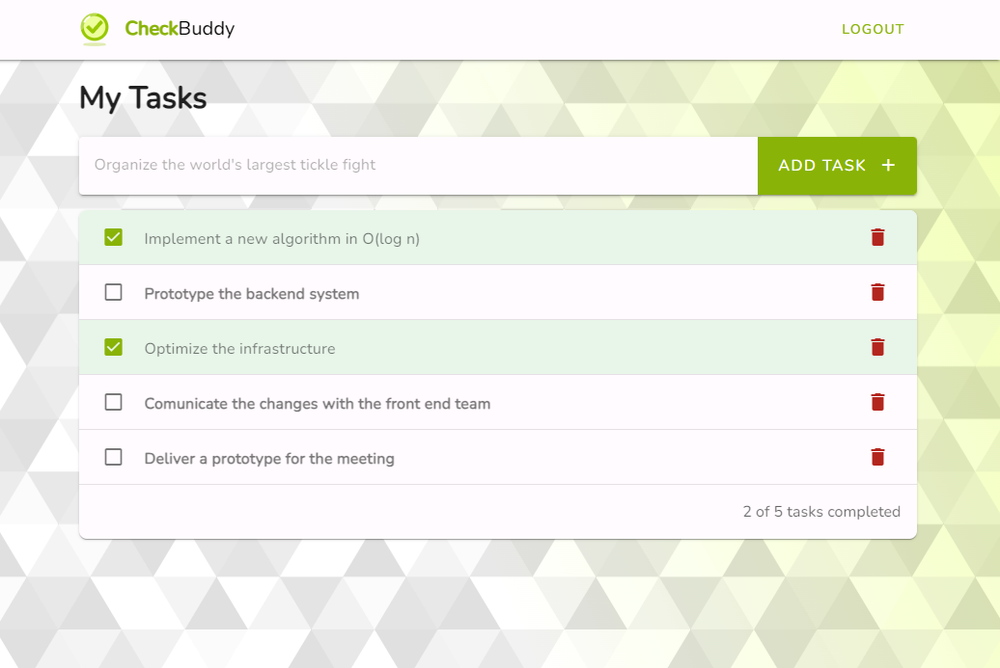

# CheckBuddy - A simple laravel checklist demo app

[](https://github.com/jhm-ciberman/todo-laravel-app/actions/workflows/run_tests.yml)



CheckBuddy is a simple laravel checklist demo app. It is a simple app that allows you to create checklists and add items to them. You can also mark items as completed and delete them. 


## Features 

**Backend**
- Laravel 10
- Laravel Fortify for authentication (login, registration & password reset)
- Laravel Sail for local development
- Laravel Pint for backend linting
- MySQL database

**Frontend SPA**
- Vue 3
- Vuetify 3
- Vue router
- ESLint for frontend linting


## Installation

Clone the repository and init your environment:

```bash
git clone git@github.com:jhm-ciberman/todo-laravel-app.git
cd todo-laravel-app
cp .env.example .env
```

The project uses Laravel Sail for local development. You can find the documentation [here](https://laravel.com/docs/10.x/sail).
The first time you run the project you need to install the dependencies:

```bash
docker run --rm \
    -u "$(id -u):$(id -g)" \
    -v "$(pwd):/var/www/html" \
    -w /var/www/html \
    laravelsail/php82-composer:latest \
    composer install --ignore-platform-reqs
```

Then you can start the project:

```bash
./vendor/bin/sail up -d
```

Then, the regular stuff:

```bash
sail artisan key:generate
sail artisan migrate
sail artisan db:seed
sail npm install
sail npm run dev
```

You can now access the project at [http://localhost](http://localhost).

## Testing

You can run the tests with:

```bash
sail artisan test
```

## Linting

To lint the code you can run Laravel Pint for the backend and ESLint for the frontend:

```bash
sail pint            # Lint backend
sail npm run lint    # Lint frontend
```

## Mail

The Sail environment comes with Mailpit. You can access it at [http://localhost:8025](http://localhost:8025) and check the emails sent by the app.